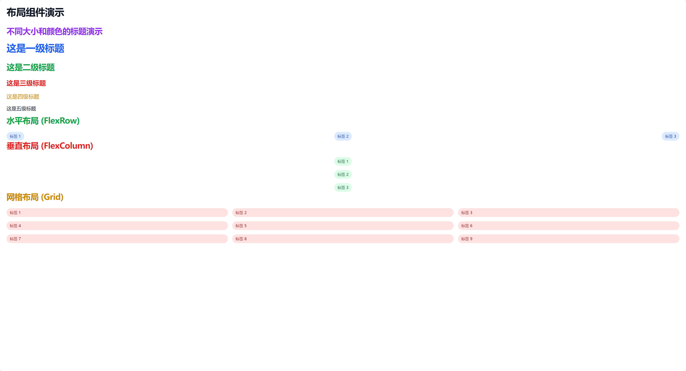

# DataViewer


<center></center>

一个简单易用的Python数据可视化工具,支持组件化开发和灵活布局。主要特点:

- 组件化开发,提供丰富的预置组件
- 支持灵活的布局系统(FlexRow、FlexColumn、Grid等)
- 内置多种主题和样式
- 简单直观的API设计

<center>
    <div style="display: flex; justify-content: center; align-items: center;gap: 10px;">
        
        
    </div>
</center>

## 主要组件

### 布局组件
- `FlexRow`: 水平弹性布局容器
- `FlexColumn`: 垂直弹性布局容器
- `Grid`: 网格布局容器

### 展示组件
- `Table`: 表格组件，支持分页、排序、自定义列宽等功能
- `JsonView`: JSON数据可视化组件，支持折叠/展开、深色/浅色主题
- `Image`: 图片组件，支持懒加载和缩放
- `Header`: 标题组件，支持多级标题和对齐方式
- `Tag`: 标签组件，支持多种颜色和尺寸
- `Video`: 视频组件，支持多种样式

## Quick Start

```bash
pip install git+https://github.com/suizongbuhenatie/dataviewer.git

python examples/run_demos.py # 输出结果在output目录下
```

## 使用示例

### 表格组件示例
```python
from dataviewer import Page, Table

data = [
    {"id": 1, "name": "张三", "age": 25},
    {"id": 2, "name": "李四", "age": 30}
]

with Page("表格示例") as page:
    Table(data=data)

    page.save("table_demo.html")
```

### JSON视图组件示例
```python
from dataviewer import Page, JsonView, FlexColumn

# 示例JSON数据
data = {
    "name": "张三",
    "age": 30,
    "hobbies": ["读书", "游泳"],
    "address": {
        "city": "北京",
        "street": "朝阳路"
    }
}

with Page("JSON示例") as page:
    with FlexColumn(padding="2"):
        JsonView(data, theme="dark")

    page.save("json_demo.html")
```

### 布局组件示例
```python
from dataviewer import Page, FlexRow, FlexColumn, Header, Image

with Page("布局示例") as page:
    with FlexRow(gap="20px", justify="between"):
        with FlexColumn(padding="2"):
            Header("左侧内容")
            Image("path/to/image.jpg", width=300)
        with FlexColumn(padding="2"):
            Header("右侧内容")
            Image("path/to/image2.jpg", width=300)

    page.save("layout_demo.html")
```

## 贡献指南

欢迎提交 Issue 和 Pull Request 来帮助改进 DataViewer。

## 许可证

本项目采用 MIT 许可证。
